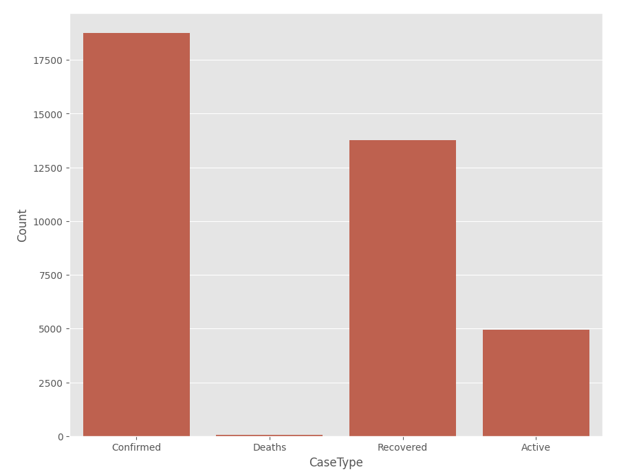

🦠 COVID-19 Analysis
This project analyzes the COVID-19 dataset and visualizes its trends using Python. It focuses on global and country-level patterns (with a special case study on Nepal)
and provides meaningful insights with data visualization.

Features

-> Global trend visualization (Confirmed, Deaths, Recovered, Active cases)
-> Country-specific trend visualization (Nepal)
-> Bar plots and heatmaps for comparison between countries and regions
-> Sorting and finding Top 5 highest countries by:
         Confirmed cases
         Recovered cases
         Active cases
         Deaths

Requirements
1. Python 
2. pandas 
3. numpy 
4. matplotlib 
5. seaborn

Heat Map
A heatmap is a data visualization technique that represents the magnitude of a phenomenon as color in two dimensions. The variation in color, or "heat," is used to
show where the concentration of a certain variable is higher or lower.

Why Heatmap?
Heatmaps are excellent for comparing two different categories of data.For example, we can place WHO regions or countries on one axis, and case types such a
Confirmed, Deaths, Recovered, and Active on the other axis. The resulting heatmap will immediately show which regions have the highest confirmed cases, where 
recovery rates are stronger, or which areas are most affected by deaths and active cases.

For Nepal

